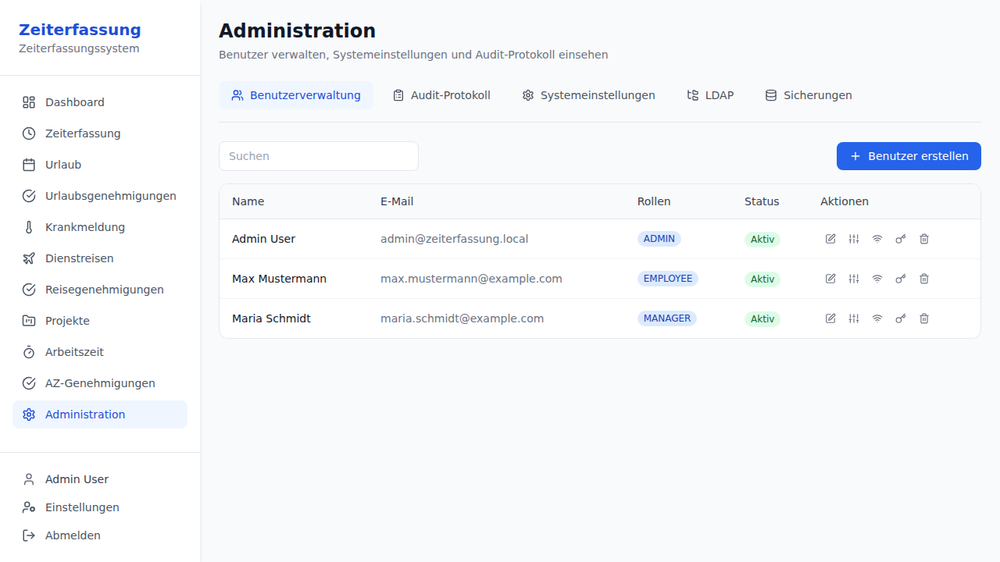
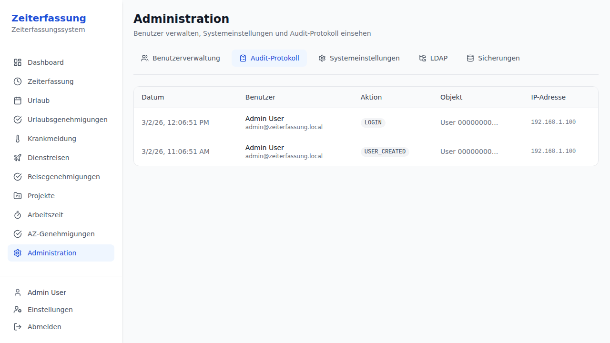
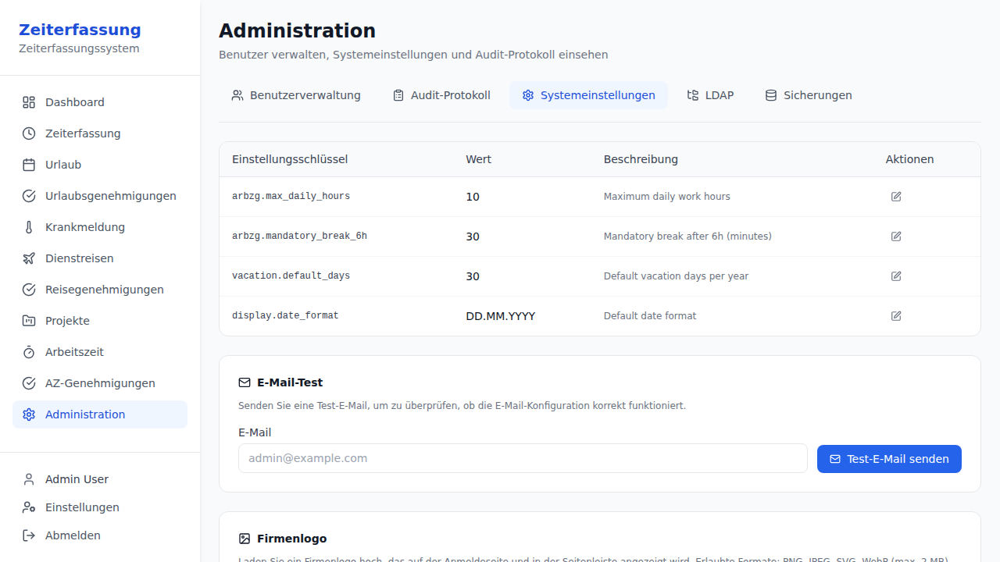

# Administration Guide — Zeiterfassung

> This guide covers system administration tasks for Zeiterfassung.

---

## Admin Panel

The admin panel is accessible to users with the **ADMIN** or **SUPER_ADMIN** role.

### User Management

The User Management tab allows you to:

- **Create users**: Click "Create User" to add a new employee with email, name, password, and role assignment
- **Edit users**: Click on a user to modify their details
- **Assign roles**: EMPLOYEE, MANAGER, ADMIN, SUPER_ADMIN
- **Assign manager**: Set a reporting manager for each employee
- **Assign substitute**: Configure a deputy who can act on behalf of a manager for their team
- **RFID management**: Assign or update RFID badge IDs for NFC terminal access
- **Reset passwords**: Reset a user's password from the admin panel
- **Deactivate/Delete users**: Soft-delete users (GDPR-compliant)

#### Manager Substitute Feature

A substitute (Stellvertreter) can be configured for any manager. When assigned:
- The substitute sees the manager's team members in their dashboard
- The substitute can approve/reject vacation requests for the manager's team
- The substitute can view time entries and balances for the manager's team
- This is useful for covering during manager absences

### Audit Log

The Audit Log tab shows a chronological record of all significant system events:
- Login/logout events
- User creation, modification, deletion
- Permission changes
- Password resets
- TOTP 2FA enable/disable
- Vacation request state changes

Each entry shows the action, user, entity, IP address, and timestamp.

### System Settings

The System Settings tab lets you configure global system parameters:

| Setting | Description |
|---------|-------------|
| `arbzg.max_daily_hours` | Maximum daily work hours (default: 10) |
| `arbzg.mandatory_break_6h` | Mandatory break after 6h of work in minutes (default: 30) |
| `arbzg.mandatory_break_9h` | Mandatory break after 9h of work in minutes (default: 45) |
| `arbzg.min_rest_hours` | Minimum rest between work days in hours (default: 11) |
| `vacation.default_days` | Default vacation days per year (default: 30) |
| `vacation.carry_over_max` | Maximum vacation days that carry over to next year |
| `display.date_format` | System default date format |
| `display.time_format` | System default time format |

### LDAP / Active Directory Configuration

The LDAP tab allows integration with an LDAP or Active Directory server for centralized authentication:

- **LDAP URL**: Connection URL (e.g., `ldaps://ldap.example.com:636`)
- **Base DN**: Base Distinguished Name for searches
- **User/Group Search**: Filters for finding users and groups
- **Manager DN/Password**: Credentials for LDAP bind
- **Active Directory Mode**: Enable for AD-specific features
- **Attribute Mapping**: Map LDAP attributes to Zeiterfassung user fields

---

## Email Configuration

Zeiterfassung sends emails for:
- Vacation request notifications (created, approved, rejected, cancelled)
- Monthly hours and vacation balance reports
- Password reset links
- Test emails from the admin panel

### Configuration

Set the following environment variables:

| Variable | Description | Default |
|----------|-------------|---------|
| `MAIL_ENABLED` | Enable/disable email sending | `false` |
| `MAIL_HOST` | SMTP server hostname | `localhost` |
| `MAIL_PORT` | SMTP server port | `587` (prod) / `1025` (dev) |
| `MAIL_USERNAME` | SMTP authentication username | _(empty)_ |
| `MAIL_PASSWORD` | SMTP authentication password | _(empty)_ |
| `MAIL_SMTP_AUTH` | Enable SMTP authentication | `true` (prod) / `false` (dev) |
| `MAIL_SMTP_STARTTLS` | Enable STARTTLS | `true` (prod) / `false` (dev) |
| `MAIL_FROM` | Sender email address | `noreply@zeiterfassung.local` |

### Testing Email

Use the admin panel to send a test email:
1. Go to **Administration** → **System Settings**
2. Use the "Send Test Email" feature
3. Enter a recipient email address
4. Check for delivery

> **Note**: The development profile defaults to MailHog on `localhost:1025`. All SMTP settings can be overridden with environment variables even in development mode.

---

## Security

### Two-Factor Authentication (TOTP)

- Users can enable 2FA from their Settings page
- Admins can see TOTP status in the user list
- TOTP uses RFC 6238 with ±1 time step window

### Account Lockout

- After 5 failed login attempts, accounts are locked for 15 minutes
- Lockout events are logged in the audit trail

### Password Policy

- Minimum 8 characters
- Password reset tokens expire after 1 hour
- Used tokens cannot be reused

### GDPR / DSGVO Compliance

- Employees cannot access other employees' personal time or vacation data
- All data modifications are audit-logged
- Soft-delete preserves data while preventing access
- Users can export their own data

---

## Sick Leave Management

Employees can report sick leave through the **Sick Leave** page. Managers are automatically notified by email.

### Workflow
1. Employee reports sick leave (start date, end date, optional notes)
2. Status changes to **Reported**
3. Employee submits medical certificate → status changes to **Certificate Received**
4. Managers can also report sick leave on behalf of an employee

### Overlap Detection
The system prevents overlapping sick leave entries. If an employee tries to report sick leave for dates that overlap with an existing non-cancelled entry, the request is rejected.

---

## Business Trip Management

Employees can request business trips through the **Business Trips** page.

### Workflow
1. Employee creates a trip request (destination, purpose, dates, estimated cost)
2. Manager approves or rejects the request
3. After the trip, the employee marks it as **Completed** with actual costs

### Manager Approval
Managers see pending trip requests in the **Trip Approvals** page and can:
- **Approve** with optional notes
- **Reject** with a mandatory reason

---

## Project / Cost Center Management

Administrators can create and manage projects via the **Manage Projects** tab on the Projects page.

### Project Setup
1. Navigate to **Projects** → **Manage Projects**
2. Enter project name, code, description, and cost center
3. Click **Create Project**

### Time Allocation
Employees allocate their time to projects via the **New Allocation** tab:
- Select a project from the dropdown
- Choose the date and enter minutes worked
- Add optional notes

Administrators can view all allocations for a project through the API (`GET /projects/{projectId}/allocations`).

---

## Terminal Management

### Raspberry Pi NFC Terminal Setup

1. Install the terminal binary on the Raspberry Pi
2. Configure `terminal.toml` with API endpoint, display settings, and RFID reader
3. Set a unique `terminal_id` for each physical terminal
4. The terminal operates in fullscreen kiosk mode

### Offline Mode

When the backend is unreachable:
- Clock events are buffered locally in a SQLite database
- Events sync automatically when connection is restored (FIFO order)
- The terminal shows an offline indicator
- Race conditions during sync are handled with HTTP 409 protection

### Configuration Reference

See the `terminal.toml` file for all configurable options including:
- Display resolution, orientation, and theme
- API endpoint and timeouts
- RFID reader settings and debounce
- Audio feedback (success/error sounds)
- Offline buffer settings
- Locale/language
