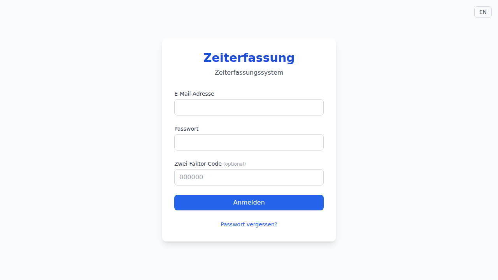
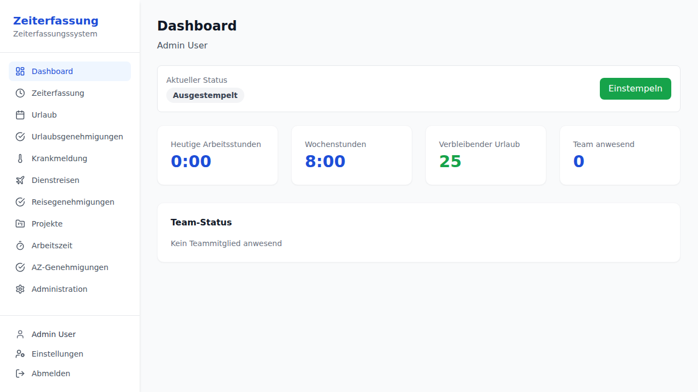
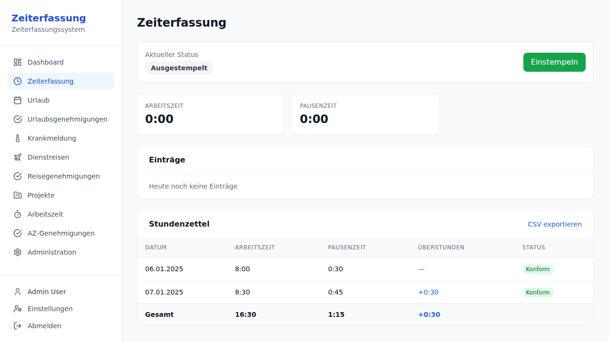
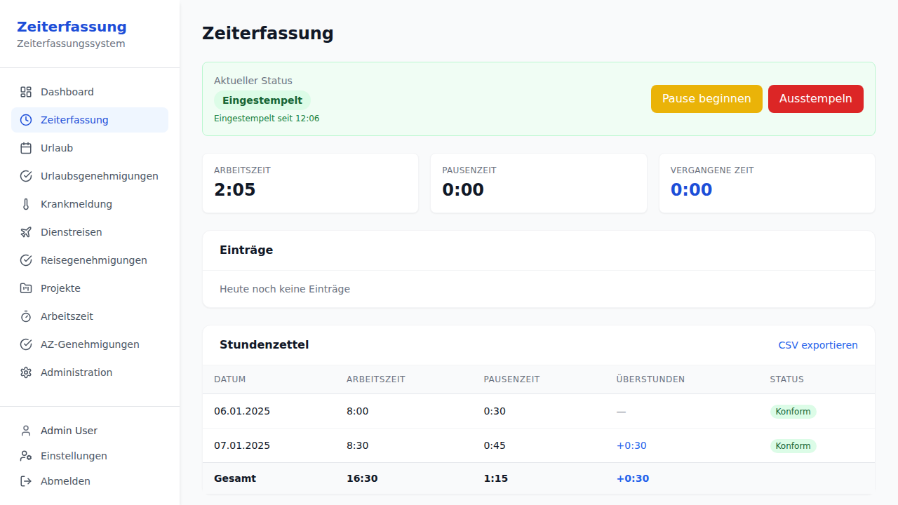
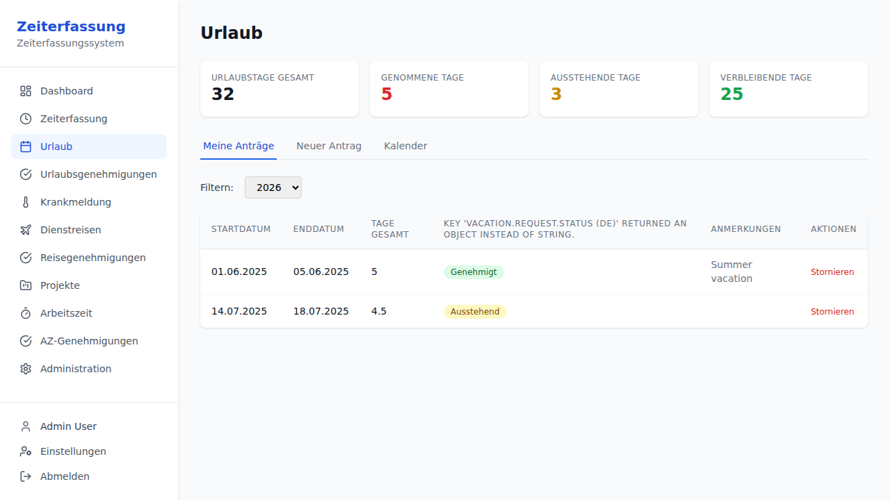
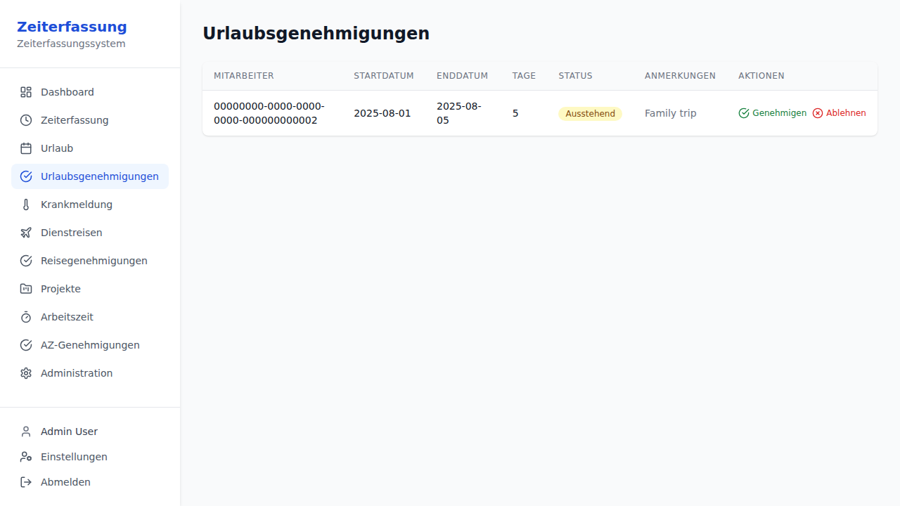
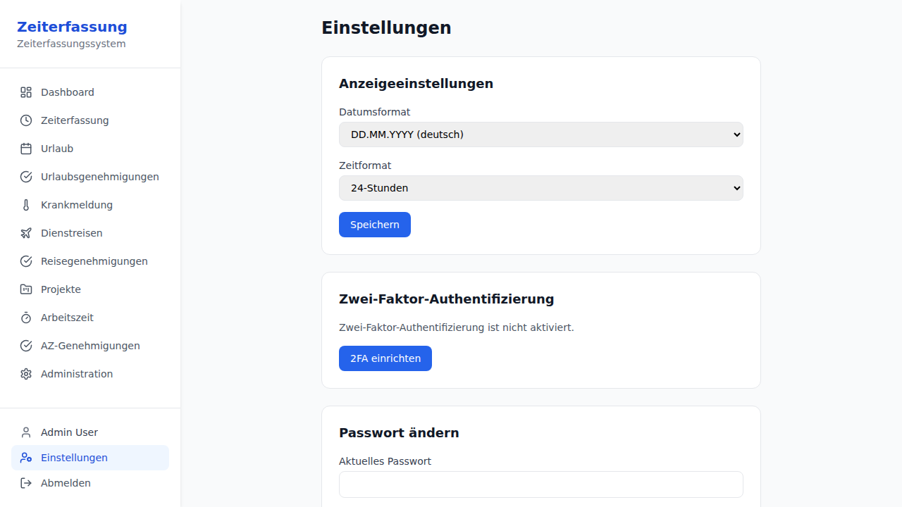
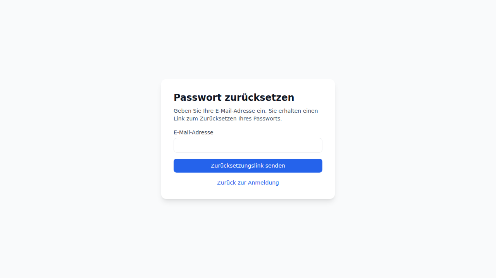

# User Guide — Zeiterfassung

> This guide covers how to use the Zeiterfassung time tracking system as an employee.

---

## Getting Started

### Logging In

Navigate to the Zeiterfassung login page and enter your email address and password.

- **Language**: Toggle between German and English using the language buttons.
- **Forgot Password**: Click "Forgot Password?" to request a password reset email.
- **Two-Factor Authentication**: If your account has 2FA enabled, you will be prompted for a TOTP code after entering your credentials.

---

## Dashboard

After logging in, you will see the **Dashboard** with an overview of your work day:

The dashboard shows:
- **Today's Work Hours**: Hours worked today
- **Weekly Hours**: Total hours for the current week
- **Remaining Vacation**: Available vacation days
- **Team Present** (managers): Number of team members currently clocked in

---

## Time Tracking

The **Time Tracking** page is where you record your work hours.

### When Clocked Out

Click **Clock In** to start your work day.

### When Clocked In

While clocked in, you can:
- **Start Break**: Begin a break (the system tracks break time separately)
- **Clock Out**: End your work day

The page also shows:
- **Today's entries**: List of all time entries for today
- **Monthly timesheet**: A table showing daily summaries with compliance status
- **CSV Export**: Download your time data as CSV

### ArbZG Compliance

The system automatically checks compliance with German labor law (Arbeitszeitgesetz):
- Maximum 10 hours of work per day
- Mandatory breaks (30 min after 6h, 45 min after 9h)
- Minimum 11 hours of rest between work days

Non-compliant days are marked with a ⚠️ badge in the monthly timesheet.

---

## Vacation Management

The **Vacation** page lets you manage your vacation requests.

### Vacation Balance

The balance card at the top shows:
- **Total days**: Your annual vacation entitlement
- **Used days**: Days already taken
- **Remaining days**: Days still available

### Creating a Request

1. Click the **New Request** tab
2. Select start and end dates
3. Optionally mark half-day start/end
4. Add notes if needed
5. Click **Submit**

Your manager will be notified by email. You can track the status of your requests in the **Requests** tab.

### Request Status

- 🟡 **Pending**: Awaiting manager approval
- 🟢 **Approved**: Request approved
- 🔴 **Rejected**: Request rejected (reason shown)
- ⚪ **Cancelled**: Request cancelled by you

---

## Vacation Approvals (Managers)

If you are a manager, you will see the **Vacation Approvals** page.

Here you can:
- View pending vacation requests from your team
- **Approve** requests with one click
- **Reject** requests with a reason

---

## Settings

The **Settings** page lets you customize your preferences.

### Display Preferences

- **Date Format**: Choose between DD.MM.YYYY (German), YYYY-MM-DD (ISO), or MM/DD/YYYY (US)
- **Time Format**: Choose between 24-hour or 12-hour format

### Two-Factor Authentication (2FA)

You can enable TOTP-based two-factor authentication for extra account security:
1. Click **Setup 2FA**
2. Scan the QR code with an authenticator app (Google Authenticator, Authy, etc.)
3. Enter the 6-digit verification code
4. Click **Enable**

To disable 2FA, click **Disable 2FA** on the same page.

### Change Password

Enter your current password and a new password (minimum 8 characters) to change your login credentials.

---

## Password Reset

If you forget your password:

1. Click **Forgot Password?** on the login page

2. Enter your email address
3. Check your email for a reset link
4. Click the link and enter a new password

---

## NFC Terminal (Raspberry Pi)

If your workplace has an NFC terminal, you can clock in and out by scanning your RFID badge:

1. Hold your badge near the NFC reader
2. The terminal will show a **green** screen for clock-in or **red** screen for clock-out
3. Your hours and break time are displayed on the clock-out screen

If the terminal is offline, your clock events are stored locally and synced automatically when the connection is restored.
